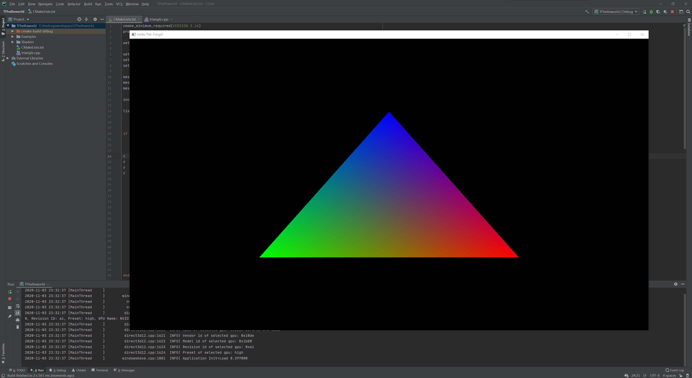

# CU-Production-The-Forge-CMake
The-Forge + CMake

[The-Forge](https://github.com/ConfettiFX/The-Forge) Minimal example.

## Shader Translator

[How to Use The Shader Translator](https://github.com/ConfettiFX/The-Forge/wiki/How-to-Use-The-Shader-Translator)
